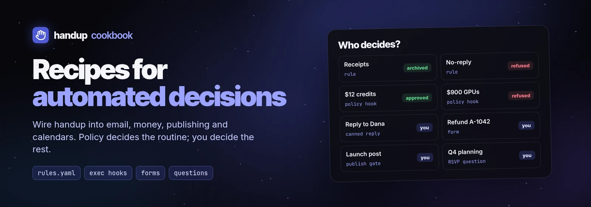

<div align="center">


# handup

**The approval inbox for AI agents.**

[](docs/public/downloads.md#linux)
[](docs/public/downloads.md#macos)
[](docs/public/mobile.md)

</div>

Your agents ask before risky actions like migrations, releases and emails. You
see exactly what they want to do and approve or deny from your terminal, desktop
or phone.

https://github.com/user-attachments/assets/cc0aa659-68e8-47e8-8d35-bafb793d742c

> **Beta.** handup runs on your Linux or Mac computer; the Android app lets you
> decide from your phone. No Windows or iPhone app yet. Releases work fully for
> a 14-day trial, then need a [license](docs/public/license.md).

## Quick start

```sh
curl -fsSL https://github.com/gethandup/handup/releases/latest/download/install.sh | sh
handup setup
```

On a Mac you can use Homebrew instead of the script:
`brew install --cask gethandup/tap/handup`. Other packages (deb, rpm, Arch,
Alpine, desktop app, Android) are on the [Releases](https://github.com/gethandup/handup/releases)
page; see [downloads](docs/public/downloads.md).

`handup setup` starts handup in the background, connects every agent it finds
(Claude Code, Codex, Cursor, omp) and installs the handup skill. Restart your
agents, then try it:

```sh
handup ask --title "Hello from handup" --wait
```

Approve it in `handup inbox`, the desktop app, or your phone. To use your
phone, install the Android app and pair it over
[Tailscale](docs/public/remote.md#tailscale-recommended) (about five minutes).

This repository holds handup's documentation, agent skill and examples. The
application source is not here.

## What you get

- **Real previews**: commands, diffs, code, Markdown, JSON, HTML, email, images,
  video, audio, PDFs and file bundles, snapshotted so what you approve is what runs.
- **Any agent that speaks MCP**: Claude Code, Codex, Cursor, omp, opencode and any
  other MCP client, plus the CLI and a local HTTP API for scripts and CI.
- **Decide anywhere**: terminal inbox, desktop app, or your phone over
  [Tailscale](docs/public/remote.md#tailscale-recommended) (five-minute setup);
  an end-to-end encrypted relay is coming soon.
- **Feedback, not errors**: deny with a note and the agent revises and asks again.
- **Fewer taps**: scoped allow rules, presence routing and a timed YOLO mode,
  with every auto-handled request still in the history.

## Pricing

- **Free 14-day trial**: every install works fully for 14 days, with no account or card.
- **Personal license, $30 one-time** (plus tax where applicable): one person, all
  their own machines, no subscription. [Buy on gethandup.dev](https://gethandup.dev/#pricing),
  then run `handup license activate <key>` ([License and trial](docs/public/license.md)).

## Set up by hand

`handup setup` runs these steps for you; run them yourself to pick and choose:

```sh
handup service install   # start handup in the background
handup integrate all     # connect every detected agent (--list shows what it found)
handup skill install     # teach agents when and how to ask (--agent claude|codex, --project)
```

Only one agent? Use
[`handup integrate claude`](docs/public/agents/claude-code.md),
[`handup integrate codex`](docs/public/agents/codex.md),
[`handup integrate omp`](docs/public/agents/omp.md), or
[`handup integrate mcp --client cursor`](docs/public/agents/cursor.md).
Agents that don't load skills can use `handup prompt` instead: it prints
instructions to paste into `AGENTS.md` or `CLAUDE.md`.

To install just the [agent skill](docs/public/agents/skill.md) without
handup: `DO_NOT_TRACK=1 npx --yes skills@1.7.0 add gethandup/handup --skill handup`.

## Docs

Read them on [docs.gethandup.dev](https://docs.gethandup.dev); the product site
is [gethandup.dev](https://gethandup.dev).

- [Getting started](docs/public/index.md)
- [Agent setup](docs/public/agents/mcp.md): [Claude Code](docs/public/agents/claude-code.md),
  [Codex](docs/public/agents/codex.md), [Cursor](docs/public/agents/cursor.md),
  [omp](docs/public/agents/omp.md), [shell/CI](docs/public/agents/shell-ci.md),
  [any agent or custom harness](docs/public/agents/custom.md)
- [Desktop](docs/public/desktop.md), [mobile](docs/public/mobile.md),
  [remote access](docs/public/remote.md), [relay](docs/public/relay.md)
- [Rules, presence and YOLO](docs/public/rules.md)
- [CLI and daemon reference](docs/public/cli.md)
- [Integrations](docs/public/integrations/index.md): event hooks, submit tokens, callbacks
- [Cookbook](docs/public/cookbook/index.md): advanced recipes for automated decisions
- [Examples](examples/README.md) and the [LLM-readable guide](llms.txt)

## Cookbook

[](docs/public/cookbook/index.md)

Advanced recipes with runnable scripts in [examples/cookbook](examples/cookbook/):

- [Canned email replies](docs/public/cookbook/email-canned-replies.md): pick a template, edit, send what you approved
- [Route email by sender](docs/public/cookbook/email-routing.md): rules archive receipts, refuse no-reply senders, flag VIPs
- [Policy auto-decider](docs/public/cookbook/auto-decider.md): a hook that decides thresholds and allowlists in code
- [Form approvals](docs/public/cookbook/form-approvals.md): adjust amount, reason and flags before approving
- [Publish gate](docs/public/cookbook/publish-gate.md): edit, then Publish now or Schedule; silence fails closed
- [Meeting replies](docs/public/cookbook/meeting-replies.md): RSVP and slot questions in one card

## Issues

Bug reports and feature requests are welcome in
[Issues](https://github.com/gethandup/handup/issues). For anything else, email
[support@gethandup.dev](mailto:support@gethandup.dev). Report security problems
privately; see [SECURITY.md](SECURITY.md).

## License

Documentation is [CC BY 4.0](LICENSE.md#documentation-cc-by-40); the agent
skill, examples and code snippets are [MIT](LICENSE.md#skill-examples-and-code-snippets-mit).
The handup application is not in this repository; it is licensed under the
[handup Terms of Service](https://gethandup.dev/terms), its end-user license agreement.
