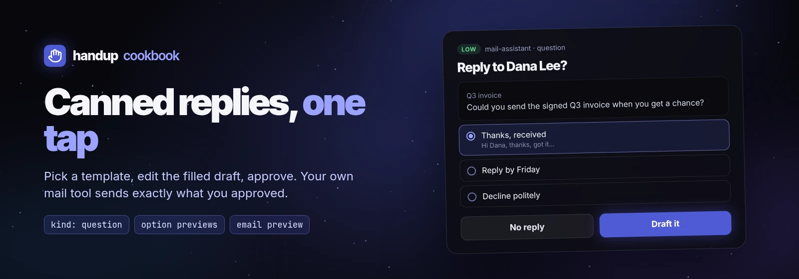

# Canned email replies



Most email needs one of a handful of answers. This recipe turns your stock
replies into a one-tap choice, then shows the filled draft for a final edit
before anything is sent. Script:
[`examples/cookbook/email-canned-reply.sh`](../../../examples/cookbook/email-canned-reply.sh).

```sh
if sh examples/cookbook/email-canned-reply.sh examples/cookbook/inbound-email.json > send.json; then
  : # send send.json once with your own mail tool (gog, himalaya, an MCP mail tool, …)
fi
```

handup never sends mail. The script prints the approved draft
`{to, cc, bcc, subject, body}` and exits 0; any other exit means do not send.

## 1. Pick a reply

A `kind: question` request shows the inbound message as an email preview and
each template as an option. An option's `preview` is Markdown shown while it
is focused, so the human reads the exact filled reply before choosing.

```json
{
  "title": "Reply to Dana Lee <dana@example.org>?",
  "summary": "Q3 invoice",
  "kind": "question",
  "tool": "email.reply.pick",
  "source": {"agent": "mail-assistant"},
  "previews": [{"type": "email", "email": {
    "from": "Dana Lee <dana@example.org>", "to": ["ari@example.com"],
    "subject": "Q3 invoice", "body": "Hi Ari,\n\nCould you send the signed Q3 invoice…"}}],
  "input": {"questions": [{
    "id": "reply", "header": "Reply", "recommended": 0, "allow_free_text": true,
    "question": "Which reply should I draft? Type your own text to use it as the body.",
    "options": [
      {"label": "Thanks, received", "preview": "Hi Dana,\n\nThanks, got it. …"},
      {"label": "Reply by Friday", "preview": "Hi Dana,\n\nThanks for the note. …"},
      {"label": "Decline politely", "preview": "Hi Dana,\n\nThanks for thinking of me. …"},
      {"label": "Book a call", "preview": "Hi Dana,\n\nThis is easier to sort out live. …"}
    ]}]},
  "options": [
    {"id": "draft", "label": "Draft it", "outcome": "approve", "style": "primary"},
    {"id": "skip", "label": "No reply", "outcome": "deny"}
  ]
}
```

The answer is in `fields.answers.reply`: `{"selected": ["Reply by Friday"]}`,
or `{"selected": [], "text": "…"}` when the human typed their own reply. The
script keeps templates in one jq object so a label always maps to its body:

```sh
body=$(printf '%s' "$answer" | jq -r --argjson t "$templates" \
  '.fields.answers.reply as $a | ($a.text // $t[$a.selected[0]]) // empty')
```

## 2. Review the filled draft

The chosen body becomes a normal [email draft approval](../agents/email.md):
an `email` preview with the original message under `in_reply_to`, and the
draft as editable `input`. `dedupe_key` is the inbound message id, so
rerunning the agent on the same email with the same draft while the first
request is still pending joins it instead of queuing a second reply.

```json
{
  "title": "Send reply to Dana Lee <dana@example.org>",
  "kind": "review", "risk": "medium",
  "tool": "email.reply.send",
  "source": {"agent": "mail-assistant"},
  "dedupe_key": "reply:<CAF-q3-invoice@example.org>",
  "timeout": "24h",
  "previews": [{"type": "email", "email": {
    "from": "ari@example.com", "to": ["Dana Lee <dana@example.org>"], "cc": [], "bcc": [],
    "subject": "Re: Q3 invoice", "body": "Hi Dana,\n\n…",
    "in_reply_to": {"from": "Dana Lee <dana@example.org>", "date": "…", "body": "…"}}}],
  "input": {"to": ["Dana Lee <dana@example.org>"], "cc": [], "bcc": [],
            "subject": "Re: Q3 invoice", "body": "Hi Dana,\n\n…"}
}
```

On approval, send `decision.fields` when present (the human edited the draft;
it is the complete draft, not a patch), otherwise your own draft. Send it
once:

```sh
printf '%s' "$decision" | jq --argjson d "$draft" '.fields // $d'
```

A denial carries feedback ("Attach the PDF first"): revise and ask again with
the revision, never resend the denied draft.

## Variations

- **One step instead of two.** If your agent writes the reply itself, skip the
  question and send only step 2. Keep the question when you want the agent to
  stay on script.
- **Per-sender templates.** Choose the template set from the sender's domain
  before asking, and set `recommended` to the usual answer for that sender.
- **Auto-approve nothing here.** Replies are external publication. Route
  low-stakes mail with [rules](email-routing.md) only for actions like
  archiving, not sending.
