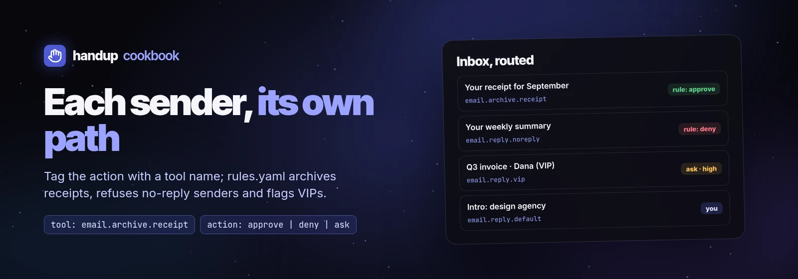

# Route email by sender



"Handle mail from X one way, mail from Y another" is two decisions: your
script **classifies** the message, and handup **rules** decide what each class
needs. The script tags every proposed action with a stable `tool` name; rules
match that name exactly. Script:
[`examples/cookbook/email-route.sh`](../../../examples/cookbook/email-route.sh),
rules: [`examples/cookbook/email-rules.yaml`](../../../examples/cookbook/email-rules.yaml).

| Sender / message | `tool` | Rule | Result |
| --- | --- | --- | --- |
| Subject looks like a receipt | `email.archive.receipt` | `approve` | Archived with label, no prompt |
| `no-reply@`, `noreply@`, `donotreply@`, `mailer-daemon@` | `email.reply.noreply` | `deny` + feedback | Agent is told why, nothing sent |
| Address in `HANDUP_VIP` | `email.reply.vip` | `ask`, `risk: high` | Prompt with high-risk alerting |
| Everyone else | `email.reply.default` | none | Normal prompt |

## Rules

Paste the rules under `rules:` in your config (`handup config edit`;
`~/.config/handup/config.yaml` on Linux). They apply as soon as you save; an
invalid save keeps the previous rules in force.

```yaml
rules:
  - id: mail-receipts-archive
    match: {agent: mail-assistant, tool: email.archive.receipt}
    action: approve
  - id: mail-no-reply
    match: {agent: mail-assistant, tool: email.reply.noreply}
    action: deny
    feedback: Never reply to no-reply senders; archive instead.
  - id: mail-vip
    match: {agent: mail-assistant, tool: email.reply.vip}
    action: ask
    risk: high
```

Matching on `agent` as well keeps these rules from touching other agents that
happen to reuse a tool name. First match wins, so put narrow rules above broad
ones. Check a request against your rules without submitting it:
`handup rules test request.json`.

## Classify in the caller

Classification is ordinary code: sender address, domain, subject, labels your
mail provider already set, or a model's verdict. The script uses a `case` and
two greps:

```sh
addr=$(jq -r '.from | capture("<(?<a>[^>]+)>").a // .' "$msg" | tr '[:upper:]' '[:lower:]')
case "$addr" in
  no-reply@* | noreply@* | donotreply@* | mailer-daemon@*) tool=email.reply.noreply ;;
  *)
    if printf '%s' "$subject" | grep -Eiq 'receipt|invoice paid|payment received'; then
      tool=email.archive.receipt
    elif [ -n "$vip" ] && printf ' %s ' "$vip" | grep -Fiq " $addr "; then
      tool=email.reply.vip
    else
      tool=email.reply.default
    fi
    ;;
esac
```

The request describes the **action**, not the email: an archive request has a
title like `Archive "Your receipt for September" as Receipts` and no editable
input; a reply request carries the draft as editable `input`.

```json
{
  "title": "Archive \"Your receipt for September\" as Receipts",
  "kind": "review",
  "tool": "email.archive.receipt",
  "source": {"agent": "mail-assistant"},
  "dedupe_key": "email.archive.receipt:<rcpt-2026-09@billing.example.net>",
  "timeout": "24h",
  "previews": [{"type": "email", "email": {"from": "Example Cloud Billing <billing@example.net>", "to": ["ari@example.com"], "subject": "Your receipt for September", "body": "…"}}]
}
```

## Reading the result

A rule decision arrives through the same wait as a human one, with
`decided_by: "rule"` and the `rule_id`. The script prints the action to
perform:

```sh
$ sh examples/cookbook/email-route.sh examples/cookbook/receipt-email.json
{"message_id": "<rcpt-2026-09@billing.example.net>", "tool": "email.archive.receipt",
 "decided_by": "rule", "action": "archive", "label": "Receipts"}

$ sh examples/cookbook/email-route.sh examples/cookbook/noreply-email.json
denied: Never reply to no-reply senders; archive instead.      # exit 1
```

Rule decisions are audited like any other: **N auto-handled · View** above the
Inbox list opens their read-only view; **Mark read** leaves them in History
and syncs the read state across devices connected to the same daemon.
`handup log --json` and `GET /v1/requests?decided_by=rule` also list them.

## Guardrails

- Auto-approve only reversible, internal actions (archive, label, snooze).
  Sending mail is publication: keep replies on `ask` or `deny`.
- Keep `tool` names specific. `email.reply` for everything would let one
  approve rule cover every reply.
- Classification happens before handup sees the request, so a wrong
  classification is a wrong rule match. Prefer signals the sender cannot forge
  easily (your provider's verified-sender labels) for anything auto-approved.
