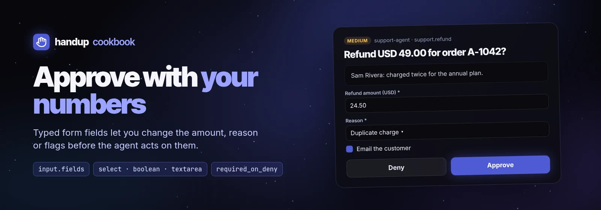

# Form approvals



When the right answer is "yes, but for a different amount", a plain
Approve/Deny forces a round trip. Declare typed form fields in
`input.fields` and the human adjusts the values in the card before approving.
This recipe gates a support refund. Script:
[`examples/cookbook/refund-form.sh`](../../../examples/cookbook/refund-form.sh).

```sh
sh examples/cookbook/refund-form.sh examples/cookbook/order.json
```

## The request

```json
{
  "title": "Refund USD 49.00 for order A-1042?",
  "summary": "Sam Rivera <sam@example.org>: Charged twice for the annual plan.",
  "kind": "review",
  "risk": "medium",
  "tool": "support.refund",
  "source": {"agent": "support-agent"},
  "dedupe_key": "refund:A-1042",
  "timeout": "8h",
  "previews": [{"type": "markdown", "inline": "**Customer:** Sam Rivera …\n\nProposed: full refund of USD 49.00."}],
  "input": {
    "feedback": "required_on_deny",
    "fields": [
      {"name": "amount", "type": "text", "label": "Refund amount (USD)", "default": "49.00", "required": true},
      {"name": "reason", "type": "select", "label": "Reason",
       "options": ["Duplicate charge", "Service issue", "Goodwill", "Other"], "default": "Duplicate charge", "required": true},
      {"name": "notify_customer", "type": "boolean", "label": "Email the customer", "default": true},
      {"name": "note", "type": "textarea", "label": "Internal note",
       "description": "Saved on the order, never sent to the customer."}
    ]
  }
}
```

Field properties:

| Property | Use |
| --- | --- |
| `name` | Key in `decision.fields`; unique, required |
| `type` | `text`, `textarea`, `select` or `boolean`; required |
| `label`, `description` | Shown above and below the control |
| `options` | Choices for `select` (strings) |
| `default` | Prefilled value; booleans default to `false` |
| `required` | The app refuses to approve until the field has a value |

`feedback: "required_on_deny"` makes a reason mandatory when the human
denies, so the agent always learns why (`handup deny ID` without `-m` is
rejected).

## Reading the decision

Approved form values arrive in `decision.fields` keyed by field `name`:

```json
{"status": "approved", "option": "approve",
 "fields": {"amount": "24.50", "reason": "Goodwill", "notify_customer": false}}
```

Merge them over the defaults the human saw, then act on the result. The
script prints the refund to execute:

```sh
refund=$(printf '%s' "$decision" | jq --slurpfile o "$order" --argjson req "$request" '
  ($req.input.fields | map({(.name): .default}) | add) as $defaults |
  ($defaults + (.fields // {})) as $f |
  {order: $o[0].order, amount: $f.amount, reason: $f.reason,
   notify_customer: ($f.notify_customer // false), note: ($f.note // "")}')
# The form is human input: check the edited amount before your payment API sees it.
printf '%s' "$refund" | jq -e --slurpfile o "$order" \
  '(.amount | tonumber? // -1) as $a | $a > 0 and $a <= ($o[0].total | tonumber)' >/dev/null || exit 4
```

```json
{"order": "A-1042", "amount": "24.50", "reason": "Goodwill", "notify_customer": false, "note": ""}
```

Text fields come back as strings, so validate edited values before acting.
The form is human input, and your payment API is the trust boundary.

## More form ideas

- **Spend approvals:** `amount`, `cost_center` (select), `recurring` (boolean).
- **Account changes:** `role` (select), `expires_in` (select), `ticket` (text, required).
- **Data exports:** `columns` (select), `redact_pii` (boolean, default true), `reason` (textarea).
- **Deploys:** `environment` (select), `canary_percent` (text), `notify_channel` (boolean).

Forms always wait for a human: [YOLO mode](../rules.md#yolo-mode) never
auto-approves a request with `input.fields`.
